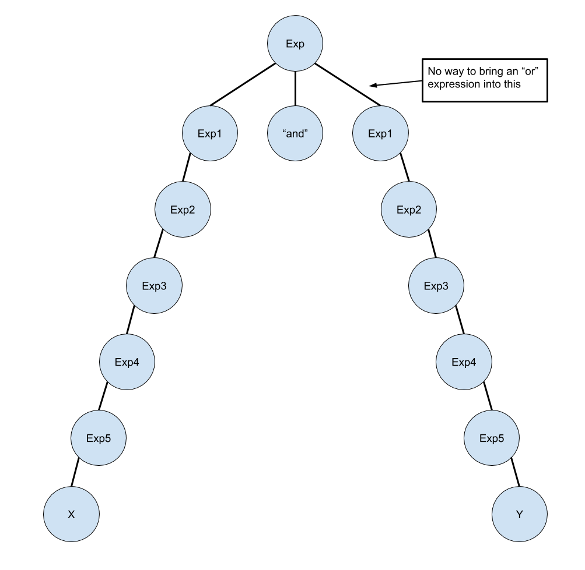
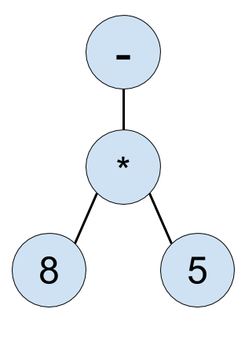

### Given a few Ohm grammar rules from the Ada programming language:  

```js
Exp     = Exp1 ("and" Exp1)* | Exp1 ("or" Exp1)* 
Exp1    = Exp2 (relop Exp2)?
Exp2    = "-"? Exp3 (addop Exp3)*
Exp3    = Exp4 (mulop Exp4)*
Exp4    = Exp5 ("**"  Exp5)? | "not" Exp5 | "abs" Exp5
comment = "--" (~"\n" any)* "\n"
```

<!-- TODO: find technical term for being on same level -->
### a) What can you say about the relative precedences of *and* and *or*?
Both "and" and "or" have equal precedence because they reside in the same level of the grammar (the "Exp" level).

<!-- TODO: Create and insert explanatory image (Alexia has it) -->
### b) If possible, give an AST for the expression X and Y or Z. (Assume, of course, that an Exp5 can lead to identifiers and numbers, etc.) If this is not possible, prove that it is not possible.
Not possible. Both the "and" and the "or" logic stem from the initial Exp level.
Both are logic operators on two Exp1's.
However, there is no way to loop BACK to Exp and re-access the "and" and "or" operations, meaning that there can only be multiple "and" OR multiple "or" comparators (because of the *'s), but there is no way to have both "and" and "or" comparators in the same expression.


### c) What are the associativities of the additive operators? The relational operators?
The additive operator is right associative because it is evaluated from right to left. 

### d) Is the not operator right associative? Why or why not?
<!-- TODO: say that it is left-associative -->

### e) Why do you think the negation operator was given a lower precedence than multiplication?
If you were to give it higher precedence than multiplication, you would not have the ability to negate both an entire expression and a singular number. For Example:  
If we had - 2 * 3 * 4  
Currently our language can interpret that both as -(2 * 3 * 4) and (-2) * 3 * 4, because we handle multiplication and then negation. If we were to evaluate negation first, we could only read this expression as (-2) * 3 * 4. 

### f) Give an abstract syntax tree for the expression -8 * 5.


### g) Suppose the grammar were changed by dropping the negation from Exp2 and adding - Exp5 to Exp4. Give the abstract syntax tree for the expression -8 * 5 according to the new grammar.