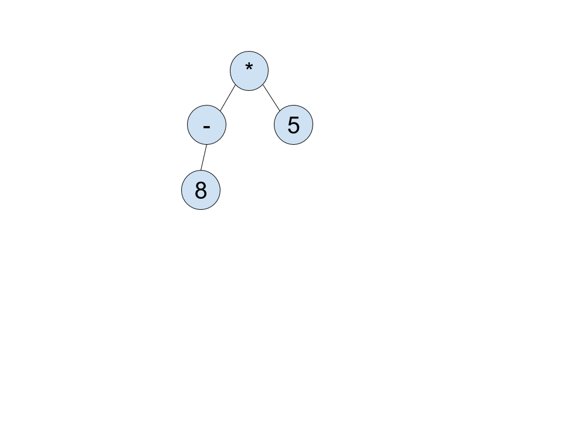

### Given a few Ohm grammar rules from the Ada programming language:

```js
Exp     = Exp1 ("and" Exp1)* | Exp1 ("or" Exp1)*
Exp1    = Exp2 (relop Exp2)?
Exp2    = "-"? Exp3 (addop Exp3)*
Exp3    = Exp4 (mulop Exp4)*
Exp4    = Exp5 ("**"  Exp5)?
        | "not" Exp5
        | "abs" Exp5
comment = "--" (~"\n" any)* "\n"
```

<!-- TODO: find technical term for being on same level -->

### a) What can you say about the relative precedences of _and_ and _or_?

Both "and" and "or" have equal precedence because they reside in the same level of the grammar (the "Exp" level).

<!-- TODO: Create and insert explanatory image (Alexia has it) -->

### b) If possible, give an AST for the expression X and Y or Z. (Assume, of course, that an Exp5 can lead to identifiers and numbers, etc.) If this is not possible, prove that it is not possible.

Not possible. Both the "and" and the "or" logic stem from the initial Exp level.
Both are logic operators on two Exp1's.
However, there is no way to loop BACK to Exp and re-access the "and" and "or" operations, meaning that there can only be multiple "and" OR multiple "or" comparators (because of the \*'s), but there is no way to have both "and" and "or" comparators in the same expression.


### c) What are the associativities of the additive operators? The relational operators?

<!-- These were all tested using the actual Ada programming language and looking up documentation as well as looking at the grammar & drawing out the ASTw -->

The additive operator is left associative and evaluated from left to right. If we use the example `10 - 4 + 2`, the expression is evaluated as `8`. The subtraction is handled first, in which we get `10 - 4 = 6` and then `6 + 2 = 8`.

The relational operators are technically evaluated left to right, but cannot be chained. `8 < 6 > 9` would not be valid in Ada because the `?` at the end of `(relop Exp2)` denotes either zero or one of those statements. Since the operators cannot be defined in a chained sequence the operator becomes non-associative. <!-- Ask Toal about this one -->

### d) Is the not operator right associative? Why or why not?

The `not` operator is not right associative. It is actually non-associative because you cannot chain the `not` operator sequentially–it can only be called once for every `Exp5` given. For example, `not not 5` is an illegal expression. Therefore, the `not` operator is non-associative.

### e) Why do you think the negation operator was given a lower precedence than multiplication?

If you were to give it higher precedence than multiplication, you would not have the ability to negate both an entire expression and a singular number. For Example:  
If we had - 2 _ 3 _ 4  
Currently our language can interpret that both as -(2 _ 3 _ 4) and (-2) _ 3 _ 4, because we handle multiplication and then negation. If we were to evaluate negation first, we could only read this expression as (-2) _ 3 _ 4.

### f) Give an abstract syntax tree for the expression -8 \* 5.


### g) Suppose the grammar were changed by dropping the negation from Exp2 and adding - Exp5 to Exp4. Give the abstract syntax tree for the expression -8 \* 5 according to the new grammar.

Given this grammar:

```js
Exp     = Exp1 ("and" Exp1)* | Exp1 ("or" Exp1)*
Exp1    = Exp2 (relop Exp2)?
Exp2    = Exp3 (addop Exp3)*
Exp3    = Exp4 (mulop Exp4)*
Exp4    = "-"? Exp5 ("**"  Exp5)?
        | "not" Exp5
        | "abs" Exp5
comment = "--" (~"\n" any)* "\n"
```

THe AST would be

